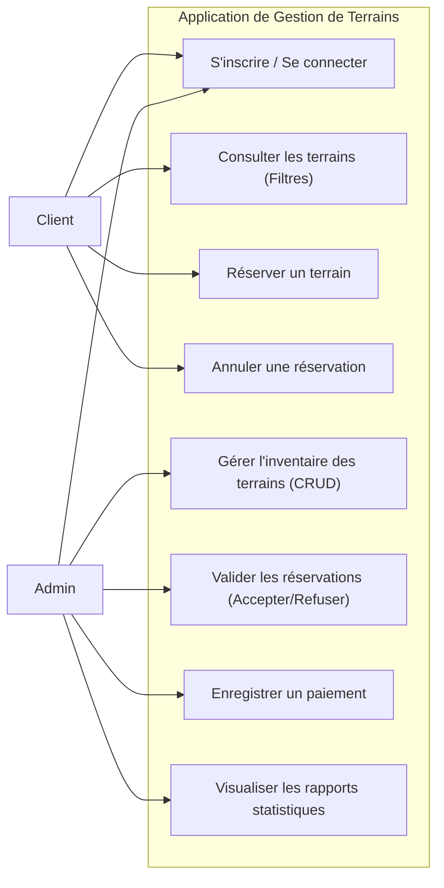
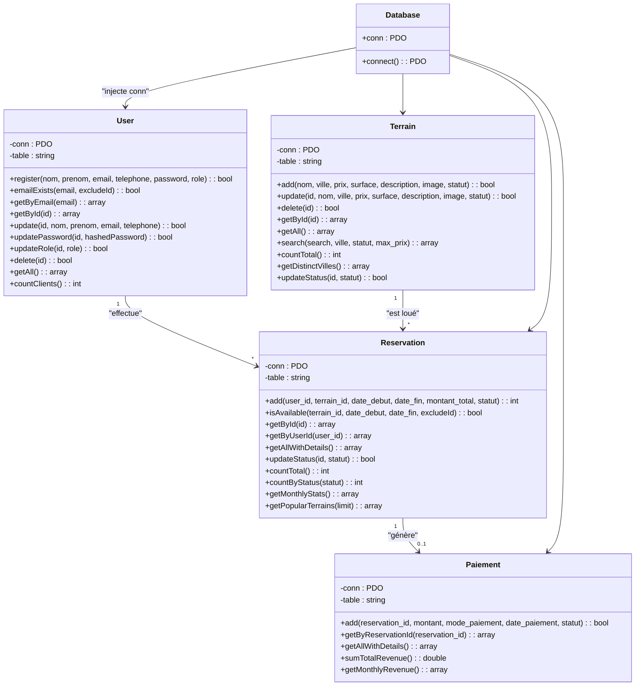
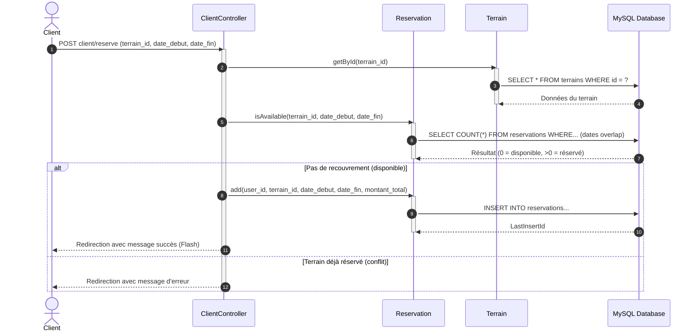

# Spécifications Techniques & Diagrammes UML

Ce document présente l'architecture logicielle, le modèle de base de données, la sécurité et les diagrammes de conception UML (cas d'utilisation, classes, séquences) de l'**Application Web de Gestion des Terrains**.

---

## 1. Architecture Logicielle (MVC Custom)

L'application est construite sur un patron de conception **Modèle-Vue-Contrôleur (MVC)** personnalisé en PHP pur :

```
                        +-------------------+
                        |   Navigateur      |
                        +---------+---------+
                                  |
                           Requêtes HTTP
                                  |
                                  v
                        +---------+---------+
                        |  public/index.php |  <--- Point d'entrée (Front Controller)
                        +---------+---------+
                                  |
                                  v
                        +---------+---------+
                        |    Router.php     |  <--- Route les URIs selon config/routes.php
                        +---------+---------+
                                  |
                                  v
                      [ Middlewares de sécurité ] (Vérification de session & rôle)
                                  |
                                  v
                        +---------+---------+
                        |   Controllers     |  <--- Orchestre les requêtes (app/controllers/)
                        +----+---------+----+
                             |         |
            Interagit avec   |         |  Génère le code HTML
                             v         v
                        +----+----+  +----+----+
                        |  Models |  |  Views  |
                        +---------+  +---------+
                       (app/models)  (app/views)
                             |
                      Accès PDO SQL
                             v
                        +---------+
                        | Base de |
                        | Données |
                        +---------+
```

### 1.1 Composants Principaux
- **Front Controller (`public/index.php`)** : Initialise la session, configure l'autoloader dynamique des classes, inclut les fonctions d'aide globales et lance le dispatching du routeur.
- **Routeur (`app/helpers/Router.php`)** : Analyse l'URI d'entrée, la normalise (même en cas de déploiement dans un sous-dossier comme `/riiiiiida/public/`), applique les middlewares configurés et instancie l'action du contrôleur approprié.
- **Middlewares (`app/middleware/AuthMiddleware.php`)** : Sécurise les routes en vérifiant le statut de connexion de la session utilisateur et le rôle requis (`admin` ou `client`).
- **Helpers (`app/helpers/functions.php`)** : Contient les fonctions utilitaires pour la sécurité XSS, la génération et vérification des jetons CSRF, et la gestion des messages flash (toasts).

---

## 2. Sécurité de l'Application

1. **Injections SQL** : Prévenues de manière systématique par l'utilisation de requêtes préparées avec l'extension PDO. Les paramètres utilisateur sont liés via des variables nommées (ex: `:email`, `:id`) empêchant toute exécution détournée du code SQL.
2. **Failles XSS (Cross-Site Scripting)** : Neutralisées par l'utilisation systématique de la fonction d'échappement `e($string)` (alias de `htmlspecialchars(..., ENT_QUOTES, 'UTF-8')`) lors de l'affichage des variables en provenance de la base de données.
3. **Failles CSRF (Cross-Site Request Forgery)** : Bloquées sur l'ensemble des formulaires de modification (POST) par la génération d'un jeton de session aléatoire unique (`csrf_token()`) vérifié côté contrôleur avant toute action d'écriture.
4. **Hachage des Mots de Passe** : Chiffrement cryptographique fort via l'algorithme Bcrypt à l'aide des fonctions natives de PHP `password_hash()` et `password_verify()`.
5. **Fixation de session** : Prévenue lors de la connexion réussie d'un utilisateur par la régénération forcée de l'identifiant de session (`session_regenerate_id(true)`).

---

## 3. Diagrammes de Conception UML

### 3.1 Diagramme des Cas d'Utilisation (Use Case)



### 3.2 Diagramme de Classes



### 3.3 Diagramme de Séquence (Vérification et Création de Réservation)



---

## 4. Modèle Logique de Données (MLD)

La base de données relationnelle est articulée autour de 4 tables clés indexées :

1. **users** (`id` INT PK, `nom` VARCHAR, `prenom` VARCHAR, `email` VARCHAR UNIQUE, `telephone` VARCHAR, `password` VARCHAR, `role` ENUM, `created_at` TIMESTAMP)
2. **terrains** (`id` INT PK, `nom` VARCHAR, `ville` VARCHAR, `prix` DOUBLE, `surface` DOUBLE, `description` TEXT, `image` VARCHAR, `statut` ENUM, `created_at` TIMESTAMP)
3. **reservations** (`id` INT PK, `user_id` INT FK -> users(id) ON DELETE CASCADE, `terrain_id` INT FK -> terrains(id) ON DELETE CASCADE, `date_debut` DATE, `date_fin` DATE, `montant_total` DOUBLE, `statut` ENUM, `created_at` TIMESTAMP)
4. **paiements** (`id` INT PK, `reservation_id` INT FK -> reservations(id) ON DELETE CASCADE, `montant` DOUBLE, `mode_paiement` VARCHAR, `date_paiement` DATE, `statut` ENUM, `created_at` TIMESTAMP)
